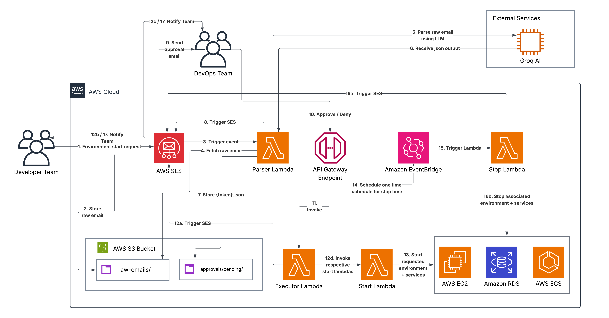

# Environment Up — Email Approval Workflow

A serverless approval system that lets DevOps engineers approve or deny environment startup requests directly from their inbox, no need to be online when a developer sends a request at odd hours.

---

## Architecture



---

## The Problem It Solves

Developers often need environments spun up outside business hours. Previously this required a DevOps engineer to be online, read the request, interpret which services and tiers were needed, manually start them, and remember to shut them down. This automation reduces that entire process to clicking Approve or Deny in an email.

---

## How It Works

### Step 1 — Developer Sends an Email

A developer sends a free-form email to the SES-verified address describing which environments they need, the services required, and the start and end times.

### Step 2 — Email Intake

AWS SES receives the email and stores the raw content in S3 under `raw-emails/` keyed by the SES message ID. The SES receipt rule triggers the Parser Lambda directly.

### Step 3 — AI Parsing

The Parser Lambda reads the raw email from S3 and sends the body to the Groq AI API running the LLaMA 3.3 70B model. The AI extracts:

- **Requester** — full name of the sender
- **Services** — EC2, RDS, ECS (inferred from keywords like "server", "database", "containers")
- **Tiers** — dev, qa, uat
- **Start time** — normalised to 12-hour format with AM/PM
- **End time** — normalised to 12-hour format with AM/PM

Defaults are applied if any field is not mentioned in the email.

### Step 4 — Approval Request Stored

The Parser Lambda generates a unique token and writes a pending approval record to S3 under `approvals/pending/{token}.json` with `status: pending`.

### Step 5 — Approval Email Sent to DevOps

The Parser Lambda sends a formatted HTML email to the DevOps admin containing the parsed request details — requester, services, tiers, start and end times, and the original email body — along with **Approve** and **Deny** buttons linked to the API Gateway endpoint.

### Step 6 — DevOps Clicks Approve or Deny

The DevOps engineer clicks either button from their inbox at any time. The button hits the API Gateway endpoint with the token and action as query parameters, triggering the Executor Lambda.

### Step 7 — Executor Acts on the Decision

The Executor Lambda reads the token from S3, checks the current status for idempotency, and acts:

**On approve:**
- 7a: Starts the requested environments (mocked Lambda invocations per tier/service combination)
- 7b: Creates an EventBridge Scheduler one-time job set to fire at the requested `end_time`
- 7c: Sends a confirmation email to the requester listing all started environments

**On deny:**
- Sends a rejection email to the requester and marks the token as denied

The approval token is updated in place — `status` is overwritten to `approved` or `denied` in the same S3 key, acting as the idempotency guard against double-clicks.

### Step 8 — Automatic Shutdown at End Time

At the scheduled `end_time`, EventBridge fires the Stop Notifier Lambda, which sends a stop notice email to the requester and the DevOps team listing all environments that are stopping. The EventBridge schedule is configured with `ActionAfterCompletion: DELETE` so it self-cleans after firing.

---

## Repository Structure

```
env-approval-workflow/
├── lambdas/
│   ├── parser/
│   │   └── lambda_function.py         # Email intake, AI parsing, approval email
│   ├── executor/
│   │   └── lambda_function.py         # Approve/deny logic, scheduler creation
│   └── stop-notifier/
│       └── lambda_function.py         # Scheduled stop notification
├── docs/
│   └── architecture-diagram.png       # System architecture diagram
├── .gitignore
└── README.md
```

---

## Email Format

Emails are free-form. The AI handles flexible formatting — no strict template required.

**Example email:**

```
Hi Team,

Can you start the qa and uat envs later tonight. Make sure the jenkins server and rds is up. We will need it from 8 to 11.


Thanks,
Simaak
```

**What the AI extracts:**

| Field | Extracted Value |
|---|---|
| Requester | Simaak |
| Services | ec2, rds |
| Tiers | qa, uat |
| Start time | 8:00 PM |
| End time | 11:00 PM |

**Defaults if not mentioned:**

| Field | Default |
|---|---|
| Services | ec2, rds, ecs |
| Tiers | dev, qa, uat |
| Start time | Not specified |
| End time | Not specified |

---

## S3 Bucket Structure

```
s3://env-approval-requests/
├── raw-emails/              # Raw emails stored by SES (keyed by SES message ID)
└── approvals/pending/       # Approval state JSON per token (status mutated in place)
```

---

## Lambda Environment Variables

### Parser Lambda (`env-request-parser`)

| Variable | Description |
|---|---|
| `API_KEY` | Groq API key |

### Executor Lambda (`env-request-executor`)

| Variable | Description |
|---|---|
| `STOP_MOCK_LAMBDA_ARN` | ARN of the stop notifier Lambda |
| `SCHEDULER_ROLE_ARN` | IAM role ARN for EventBridge Scheduler to invoke Lambda |
| `SCHEDULER_TIMEZONE` | Timezone for schedule resolution e.g. `Asia/Kolkata` |
| `DEVOPS_TEAM_EMAIL` | Optional additional recipient for stop notices |

### Stop Notifier Lambda (`env-stop-mock-notifier`)

| Variable | Description |
|---|---|
| `SOURCE_EMAIL` | SES verified sender address |
| `DEVOPS_TEAM_EMAIL` | DevOps team email for stop notices |

---

## API Gateway

A single HTTP API endpoint handles both approve and deny actions:

```
GET https://{api-id}.execute-api.{region}.amazonaws.com/approve
    ?token={uuid}
    &action=approve|deny
```

The token maps to the approval record in S3. Once actioned, replaying the same link returns an "already processed" page — the approval is idempotent.

---

## Security

- Approval links are single-use — the executor rejects any replay once a token has been actioned
- The token is a UUID generated at parse time — not guessable or enumerable
- SES sender verification ensures only emails from verified addresses trigger the workflow

---

## Audit and Traceability

Every approval record written to `approvals/pending/{token}.json` contains the full parsed request and is updated in place with the final status:

```json
{
  "sender": "simaak@example.com",
  "subject": "Environment Request - QA Tonight",
  "requester": "Simaak",
  "services": ["ec2", "rds"],
  "tiers": ["qa", "uat"],
  "start_time": "8:00 PM",
  "end_time": "11:00 PM",
  "status": "approved",
  "stop_schedule_name": "env-stop-{token}",
  "stop_scheduled_for": "2026-04-28T23:00:00+05:30"
}
```

The `sender` field links back to the original raw email at `raw-emails/{messageId}` in S3, giving full traceability from the stop notification back to the original request email.

---

<!-- ## Future Improvements

- Real Lambda invocations to actually start and stop EC2, RDS, and ECS resources per tier
- Webhook or polling confirmation that environments are healthy before sending the approval email to the requester
- SNS notifications for failed scheduler creation or Lambda invocation errors
- Support for specifying a date in addition to a time for multi-day environment requests

--- -->

## Tech Stack

- **AWS SES** — Email ingestion and outbound notifications
- **AWS Lambda** — Parser, Executor, and Stop Notifier (Python 3.12)
- **AWS S3** — Storage for raw emails and approval state
- **AWS API Gateway** — HTTP endpoint for approve/deny actions
- **AWS EventBridge Scheduler** — One-time scheduled stop trigger
- **Groq AI / LLaMA 3.3 70B** — Free-form email parsing